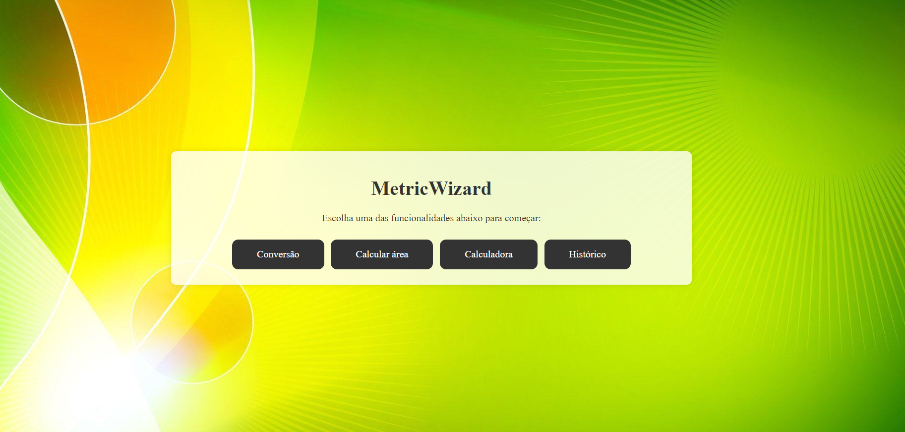
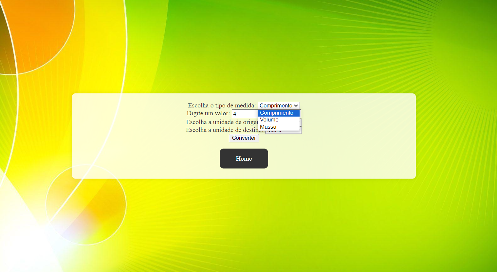
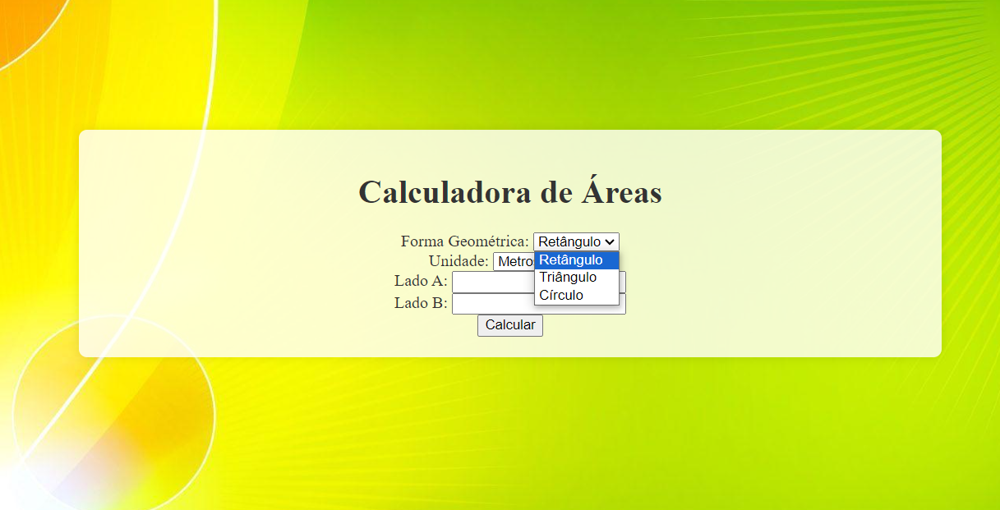
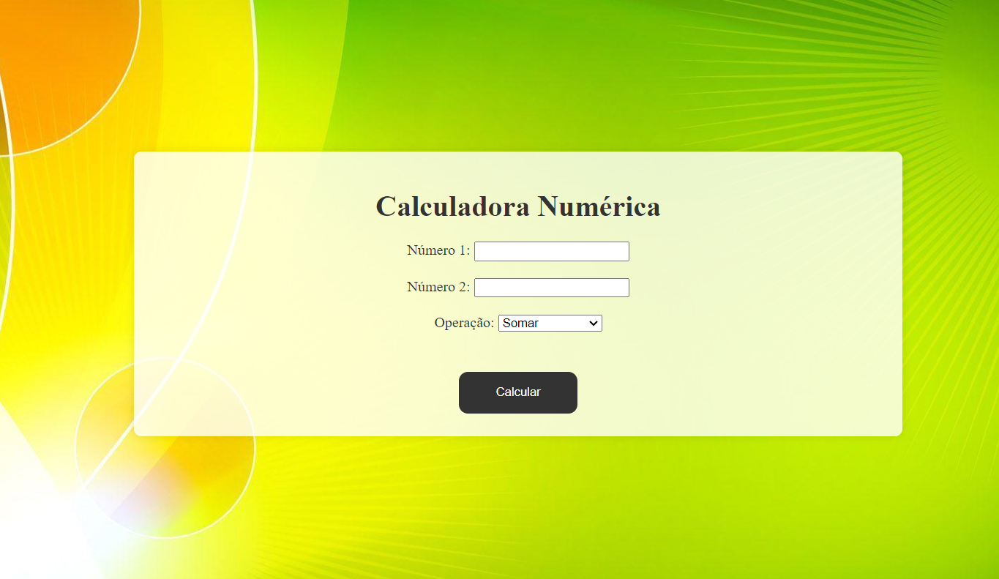

No Projeto, fizemos uma aplicação com 4 features que podem ser utilizadas: Conversão de unidades de medida, Calculadora de Área, Calculadora de operações Aritméticas básicas e o Histórico de Conversões.

Na página inicial, vemos uma tela de menu onde é possível escolher qual funcionalidade usar.

Na tela de Conversão, podemos escolher qual tipo de medida(comprimento, massa, volume) queremos usar, e a partir disso inserir um número para converter entre 2 unidades de medida.

Na tela de Calculadora de Area, podemos escolher a figura geométrica e dar a medidas dos lados/raio para que a área seja calculada.

Na tela de Calculadora, podemos escolher entre algumas operaçoes basicas e definir os numeros da operação a ser executada.

Já na tela de histórico, temos um registro das operações feitas na tela de Conversão, sendo possível excluir caso queira os elementos do histórico.

